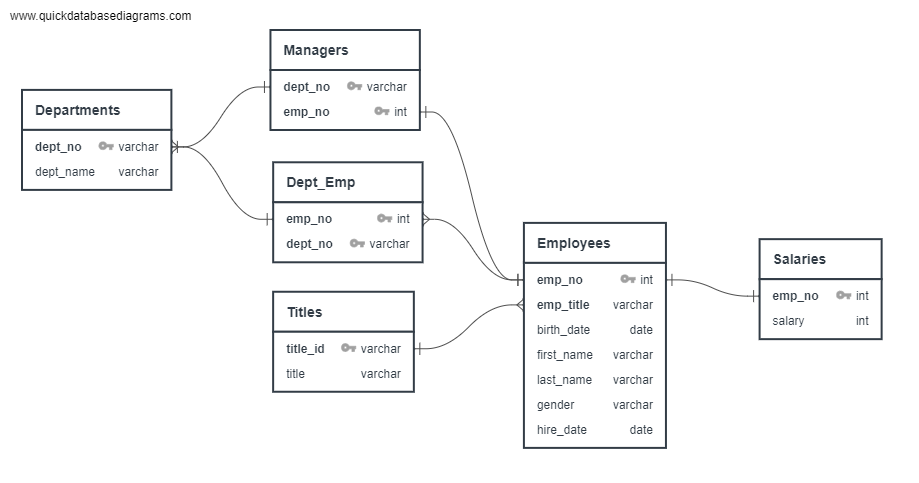

# Employee Database

## Background
Conduct research on employees of the corporation from the 1980s and 1990s. However, all that remains of the database of employees from that period are six CSV files. Design tables to hold data in the CSVs, import the CSVs into a SQL database, and answer questions about the data. 

## Methods
#### Data Modeling
First, inspect the CSVs and sketch out an ERD of the tables. I used http://www.quickdatabasediagrams.com to produce the data map below: 




#### Data Engineering
* Create a table schema for each of the six CSV files and specify the data types, primary keys, foreign keys, and other constraints.
  * Primary keys should be reserved for unique columes!
  * Create tables in the correct order to handle foreign keys.

#### Data Analysis
With the complete database, produce the following:
1. List the following details of each employee: employee number, last name, first name, sex, and salary. 
```
select e.emp_no, e.first_name, e.last_name, e.gender, s.Salary
from public."Employees" e
inner join public."Salaries" s on e.emp_no = s.emp_no
```

3. List first name, last name, and hire date for employees who were hired in 1986.
4. List the manager of each department with the following information: department number, department name, the manager's employee number, last name, first name.
5. List the department of each employee with the following information: employee number, last name, first name, and department name.
6. List first name, last name, and sex for employees whose first name is "Hercules" and last names begin with "B."
7. List all employees in the Sales department, including their employee number, last name, first name, and department name.
8. List all employees in the Sales and Development departments, including their employee number, last name, first name, and department name.
9. In descending order, list the frequency count of employee last names, i.e., how many employees share each last name.


